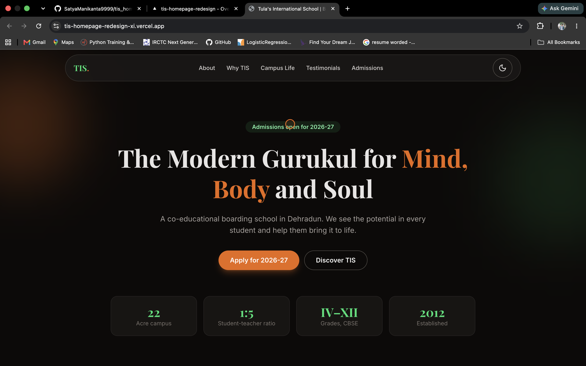
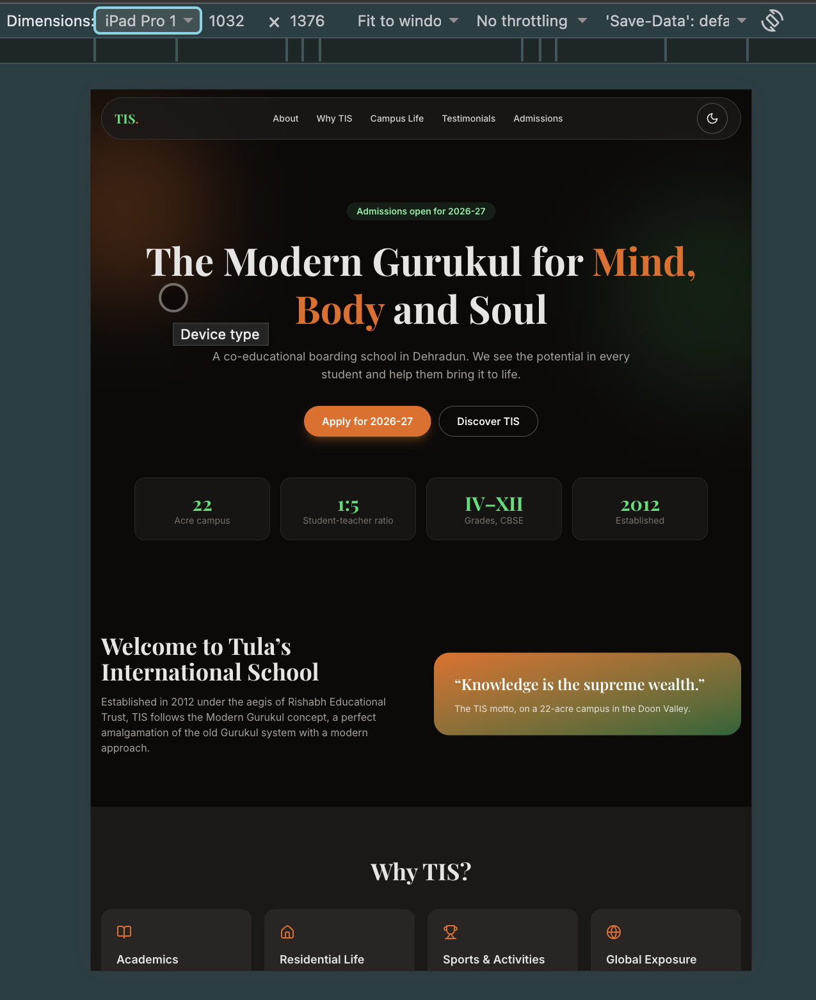
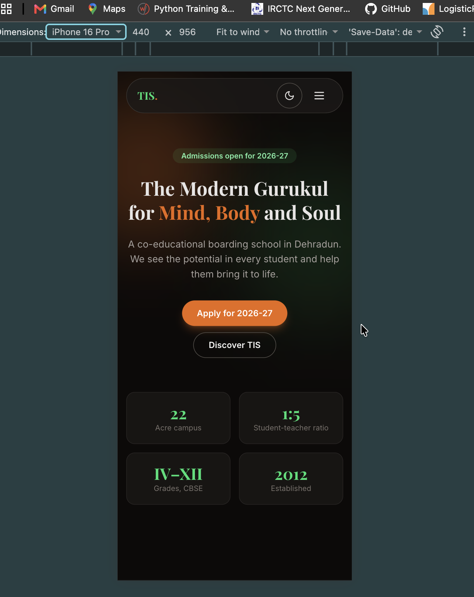

# Tulas International School (TIS) - Homepage Redesign

A modern, animated redesign of the Tula's International School homepage focused on conversion, fluid animation and mobile responsiveness.





## 🚀 Live Demo
- **Live URL:** https://tis-homepage-redesign-xi.vercel.app/
- **Repository:** https://github.com/SatyaManikanta9999/tis_homepage_redesign

## 🛠️ Tech Stack
- **Framework:** React 18 + Vite
- **Styling:** Tailwind CSS v4
- **Animations:** Framer Motion
- **Icons:** Lucide React
- **Deployment:** Vercel

## ✨ Standout Features Implemented
1. **Custom Cursor:** spring-driven ring (`useSpring`), scales on links/buttons, hidden on touch via `pointer: fine` check.
2. **Scroll-Triggered Reveals:** reusable `Reveal` component using `whileInView` + `once: true`, 0.5s staggered entrances.
3. **Animated Dark/Light Theme:** `useTheme` hook, Tailwind `dark:` variant, persisted in `localStorage`, animated icon swap.
4. **Scroll Progress Bar:** `useScroll` + `useSpring` fixed top bar in the brand gradient.

## 📦 Getting Started Locally
```bash
git clone https://github.com/SatyaManikanta9999/tis_homepage_redesign.git
cd tis_homepage_redesign
npm install
npm run dev     # http://localhost:5173
npm run build   # production build
```

## Component Architecture
- `components/ui/` - Button, Reveal
- `components/layout/` - Navbar (mobile menu), ThemeToggle, Footer
- `components/sections/` - Hero, About, WhyTIS, CampusLife, Testimonials, AdmissionsCTA
- `components/animation/` - CustomCursor, ScrollProgress
- `hooks/` - useTheme
- `data/` - all copy and school facts in `content.js`

## Brand Identity Retained
Orange and green school colours, "Modern Gurukul" positioning, motto, awards, parent testimonials and contact details from tis.edu.in.